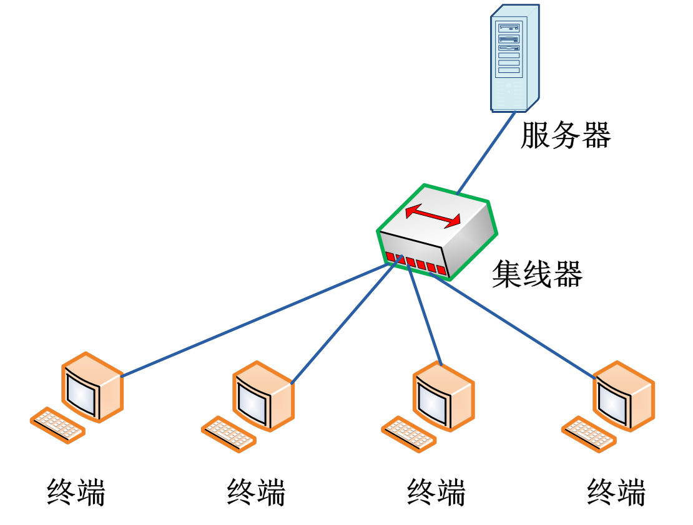
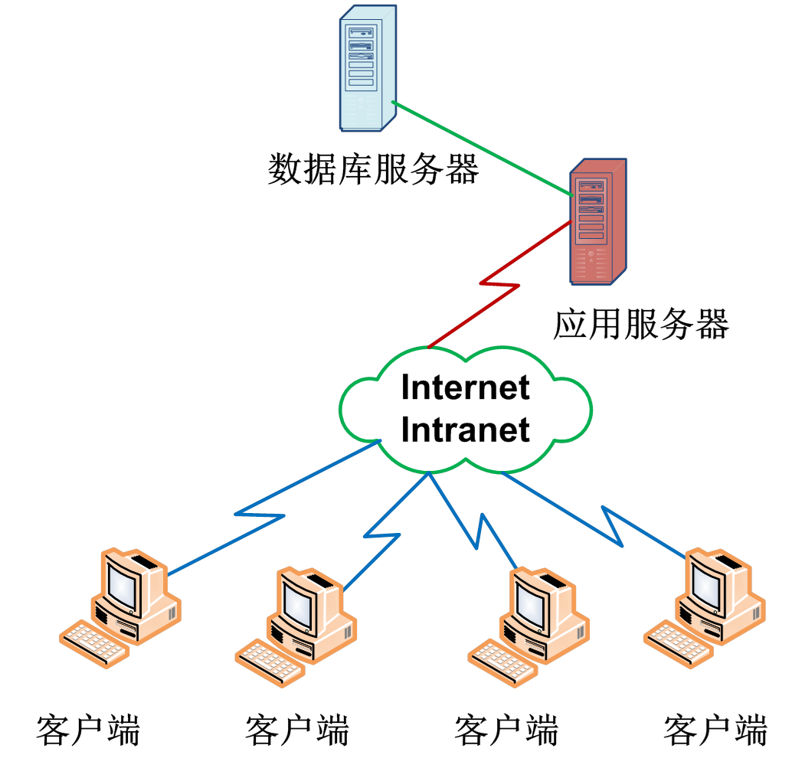
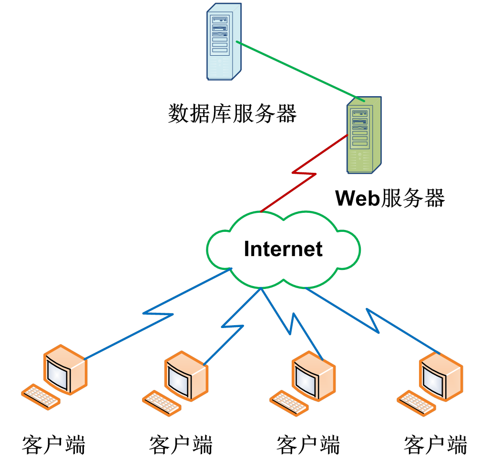

# 第一章 软件工程学概述

## 1、软件定义

- 1983年IEEE的软件定义

  **计算机程序、文档**、运行程序必须的**数据、方法、规则**。

  **方法**和**规则**在**文档**中说明，在**程序**中实现。

- 简化软件定义

  **程序 + 文档 + 数据**

****

## 2、软件分类

- 基于软件功能的划分
  1. 系统软件
  2. 支持软件
  3. 应用软件
     1. 商业数据处理软件
     2. 工程与科学计算软件
     3. 智能产品嵌入软件
     4. 人工智能软件
     5. 个人计算机软件
- 基于软件规模的划分

| 类别   | 参加人员数 | 开发周期 | 产品规模（LOC） |
| ------ | :--------: | :------: | :-------------: |
| 微型   |     1      |  1-4周   |      0.5K       |
| 小型   |     1      |  1-6月   |      1K-2K      |
| 中型   |    2-5     |  1-2年   |     5K-50K      |
| 大型   |    5-20    |  2-3年   |    50K-100K     |
| 甚大型 |  100-1000  |  4-5年   |       1M        |
| 极大型 | 2000-5000  |  5-10年  |     1M-10M      |

****

## 3、软件工程

### 3.1 软件的发展

|       程序设计        |       程序系统        |       软件工程        |     第四阶段      |
| :-------------------: | :-------------------: | :-------------------: | :---------------: |
| **50年代中-60年代中** | **60年代中-70年代中** | **70年代中-80年代中** | **80年代中-现在** |

#### 3.1.1 程序设计阶段

- 软件生产个体化

  规模小，编写者和使用者同一个人

- 软件是设计者头脑中隐含过程

  除程序清单，无文档材料保存

#### 3.1.2 程序系统阶段

- 产品软件

  由专门软件开发组织开发

- **软件作坊**

  软件开发组织，沿用早期个体化软件开发方法

- 软件危机

  软件维护工作耗费大量资源

- 软件工程

  1968年，北大西洋公约组织计算机科学家讨论软件危机，提出**软件工程**

#### 3.1.3 软件工程阶段

- 软件危机得到缓解

  打破软件生产个体化特征

  工程化的设计原则、方法和标准

- 新的挑战

  微处理器和个人计算机

  分布式处理系统

  局域网、广域网

  宽带数字通讯

#### 3.1.4 第四阶段

- 软件架构发生变化

  集中主机环境

  

  客户机/服务器（二层）

  

  客户机/服务器（三层）

  

  浏览器/服务器

  

- 新技术

  专家系统、人工智能、神经网络、并行计算、网络技术、高信度计算、云计算

****

### 3.2 软件危机

- 软件危机定义

  **在计算机软件开发和维护过程中遇到的一系列严重问题**

- 主要表现

  1. 开发成本和进度估计不准

     延迟交付、取消项目

  2. 用户对已交付软件不满意

     开发人员对用户信息交流不充分，产品不符合用户需求

  3. 软件产品质量靠不住

     软件产品保证技术（审查、复审、测试）未坚持不懈应用软件开发全过程

  4. 软件可维护性差

     开发时未考虑，很多错误难以改正

  5. 软件没有适当文档资料

     文档资料应在软件开发过程中产生，保证最新

****

### 3.3 软件工程定义

- 1993年IEEE的定义

  把系统化、规范化、可度量的途径应用于软件开发、运行和维护过程中；研究其实现途径

****

### 3.4 软件工程内容

#### 3.4.1 软件工程技术

软件开发方法学

软件开发过程

软件工具和软件工程环境

#### 3.4.2 软件工程管理

软件管理学

软件经济学

软件心理学

****

## 4、软件生产周期

### 4.1 软件生产周期定义

定义：软件从产生、发展到成熟、直到衰亡为止。

组成：**软件定义**、**软件开发**、**软件维护**。

### 4.2 软件生存周期阶段划分

国标《计算机软件开发规范》，分8阶段：

- 可行性研究与计划
- 需求分析
- [总体设计](../img/c1/集中主机.png)
- 详细设计
- 实现（编码和单元测试）
- 集成测试
- 确认测试
- 使用和维护

### 4.3 各阶段完成的基本任务

#### 4.3.1 可行性研究

关键任务：

​	解决问题是什么？有行得通解决方法？粗略计划

问题定义报告：

​	问题性质、工程目标、工程规模。

可行性研究报告：

​	经济、技术、社会（操作）可行性。

项目开发计划：

​	粗略

#### 4.3.2 需求分析

关键任务：

​	目标系统必须作什么？

​	可行性研究的需求分析是粗略、不准确；

​	需求分析是完整、准确、清晰、具体。

需求规格说明书：

​	目标系统需求。

#### 4.3.3 总体设计

关键任务：

​	怎样实现目标系统？

​	根据需求设计方案；分析推荐最佳方案；设计软件结构等。

总体设计说明书：

​	记录总体设计结果。

#### 4.3.4 详细设计

关键任务：

​	该怎样具体实现系统？

​	设计每个模块的算法和数据结构。

详细设计说明书：

​	用恰当表达工具表达算法和数据结构。

#### 4.3.5 实现（编码和单元测试）

关键任务：

​	选择语言、工具翻译详细设计结果、测试模块。

实现阶段文档：

​	程序清单、单元测试报告。

#### 4.3.6 集成测试

关键任务：

​	将经过单元测试模块组装起来进行测试；

​	通过测试使软件达到预定要求。

测试报告：

​	测试计划、测试方案、测试结果。

#### 4.3.7 确认测试

关键任务：

​	由用户按需求规格说明书规定进行测试。

测试报告：

​	测试计划、测试方案、测试结果。

#### 4.3.8 使用与维护

关键任务：

​	通过必要维护活动使系统持久满足用户要求。

维护类型：

​	改正性维护：软件运行过程中发现错误，进行维护。

​	适应性维护：软件运行软硬件环境变化，进行维护。

​	完善性维护：用户要求改进或扩充软件，进行维护。

​	预防性维护：为将来的维护作准备。

### 4.4 软件过程模型

​	实际从事软件开发工作时，软件规模、类型、开发环境及技术方法等因素会影响到阶段划分，及各阶段的执行顺序，形成不同生存周期模型，又称过程模型。