# 第三章 结构化设计

​	传统软件工程方法学采用结构化设计技术（SD）。

从工程管理角度结构化设计分两步：

- 概要设计：将软件需求转化为数据结构和软件系统结构。
- 详细设计：过程设计，通过对结构细化，得到软件详细数据结构和算法。

-  数据设计：数据模型及核心数据字典转变为数据结构。
- 体系结构设计：功能模型中数据流图转变成计算机模块框架。
- 接口设计：功能模型中数据流图转变成软件内部、软件与协作系统间、软件与用户间通信方式。
- 过程设计：行为模型及功能模型中的“处理规格说明”转换成软件构件过程描述

结构化设计的概念与原理

- 模块化
- 抽象
- 逐步求精
- 信息隐蔽
- 模块独立

## 一、模块化

​	模块（mdule）——“模块”又称“构件”一般指用一个名字调用的相邻程序元素序列。

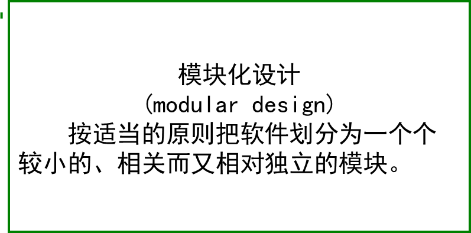

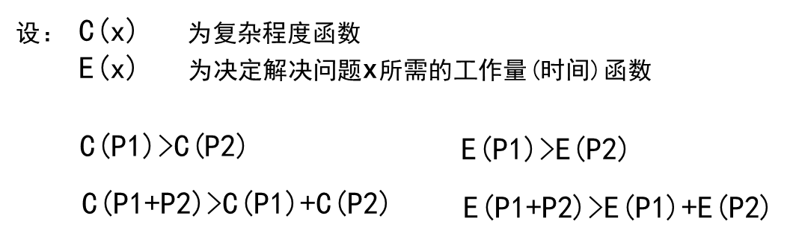

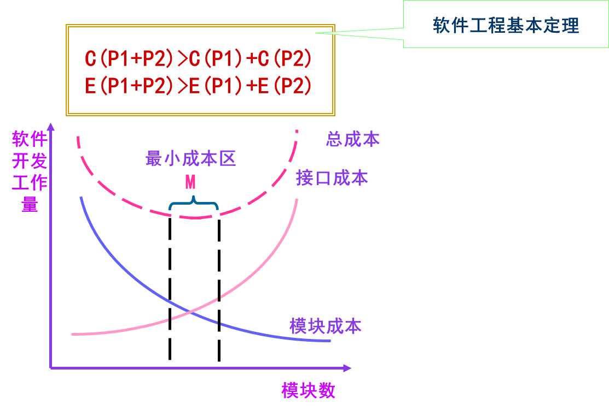

## 二、抽象

​	抽象事物的本质特性，暂不考虑细节。

## 三、求精

​	求精是指为了能集中精力解决主要问题，尽量推迟对细节问题的考虑，实际上是一个细化过程，与抽象是互补的概念。

​	抽象使得设计者能够说明过程和数据，同时忽略底层细节；

​	求精帮助设计者在设计过程中揭示底层细节。

## 四、信息隐蔽

​	每个模块的实现细节对于其他模块来说是隐蔽的，也就是说，模块中所包含的信息是不允许其他不需要这些信息的模块访问的。

​	每个客户只能通过接口来了解该模块，而所有的实现都隐蔽起来。

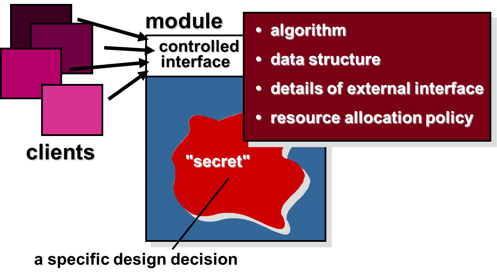

## 五、模块独立

具有独立功能且和其他模块没过多作用。

1. 容易分工合作；
2. 容易测试和维护，修改工作量较小，错误传播范围小，扩充功能容易，

两个定性度量标准：耦合和内聚。

### 5.1 耦合

​	**软件结构中不同模块间互连程度度量。**

​	取决模块间接口复杂程度，通过接口数据。追求尽可能松散耦合系统。

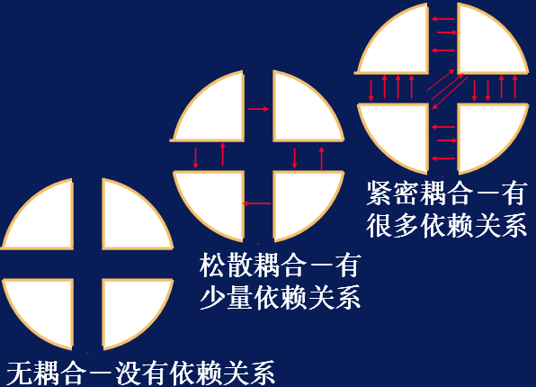

- **非直接耦合**

  两个模块分别能独立地工作，不需要另一模块存在。

- **数据耦合**

  两模块通过参数交换数据信息。

  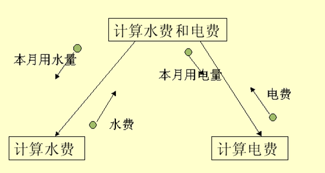

- **控制耦合**

  两模块通过参数交换控制信息（包括数字形式）

  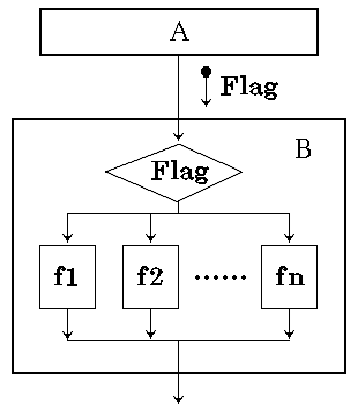

- **公共环境耦合**

  两个或多个模块通过一公共数据环境作用。

  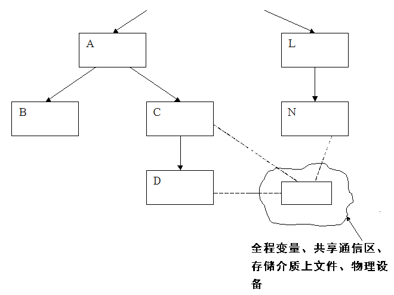

  - 一模块送数据，另一模块取，等价数据耦合。

  - 两模块既往公共环境送又从里面取，介于数据耦合和控制耦合之间

    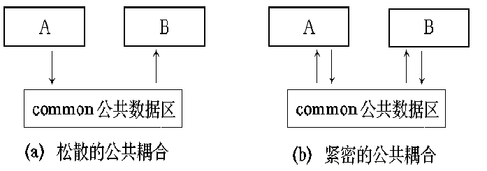

- 内容耦合

  1. 一模块访问另一模块内部数据；
  2. 一模块不通过正常入口转到另一模块内部；
  3. 两模块有部分程序代码重叠（汇编程序）；
  4. 一模块有多个入口。

  

原则：尽量使用数据耦合，少用控制耦合，限制公共环境耦合，完全不用内容耦合。

### 5.2 内聚

**定义：**

​	**模块内各元素彼此结合紧密程度。**

- 功能内聚

  一模块中各部分是完成某一功能必不可少组成部分。

- 顺序内聚

  模块内处理元素同某功能密切相关，顺序执行。

- 通信内聚

  一模块内各功能部分都使用相同输入数据，或产生相同输出数据。

  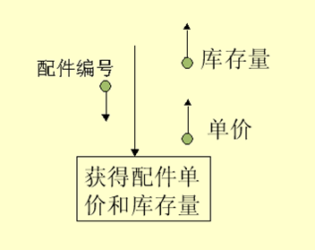

- 过程内聚

  模块内处理元素相关，特定次序执行，如把流程图中循环部分、判定部分、计算部分分成三个模块，这三个模块都是过程内聚模块。

  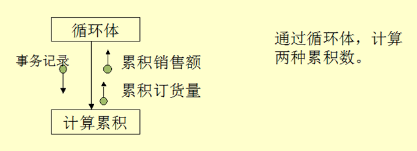

- 时间内聚

  多为多功能模块，要求所有功能在同一时间内执行。如初始化模块和终止模块及紧急故障处理模块。

- 逻辑内聚

  一模块完成功能在逻辑上属相同相似一类。

  

- 偶然内聚

  模块内各部分间没有联系，即使有也很松散。

  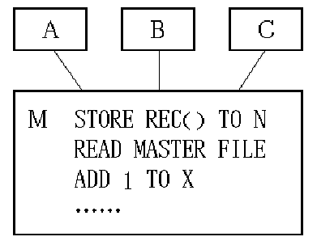

各个内聚评分：

1. 功能内聚：10分
2. 顺序内聚：9分
3. 通信内聚：7分
4. 过程内聚：5分
5. 时间内聚：3分
6. 逻辑内聚：1分
7. 偶然内聚：0分

## 六、启发规则

1. 改进软件结构提高模块独立性

   初步结构分解或合并，降低耦合提高内聚

   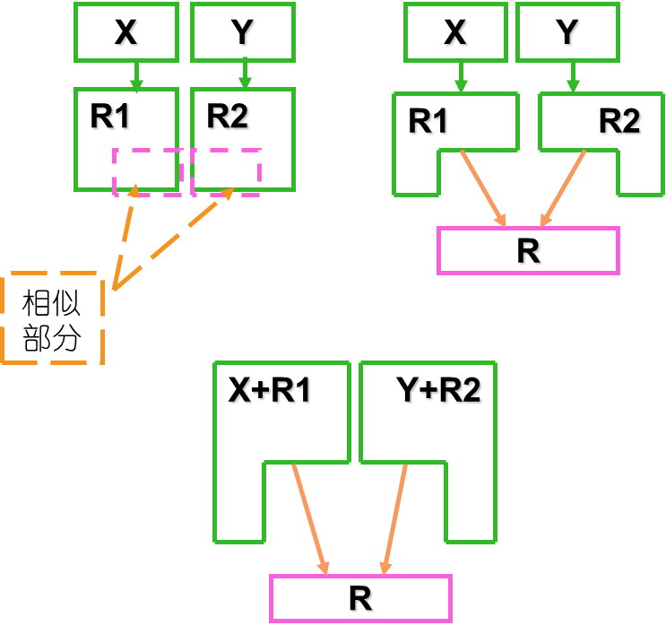

2. 模块规模应该适中

   过大分解不充分，但进一步分解不应降低模块独立性。过小开销大于有效操作，模块数目过多系统接口复杂。通常语句行数在50-100，最多不超过500行。

3. 深度、宽度、扇出和扇入应适当

   深度：软件结构控制层数，标识一系统大小和复杂程度。

   宽度：软件结构同一层次模块数最大值，越大系统越复杂。

   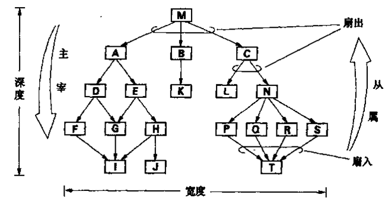

   扇出：一模块直接控制（调用）模块数，过大，模块复杂，过小也不好。一般在3-9

   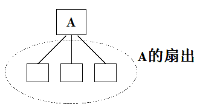

   扇入：有多少上级模块直接调用它，越大共享该模块上级模块越多。

   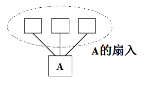

   扇入扇出不合适的改善：

   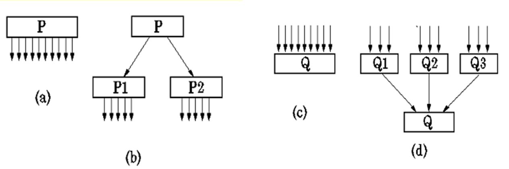

   改善示例：

   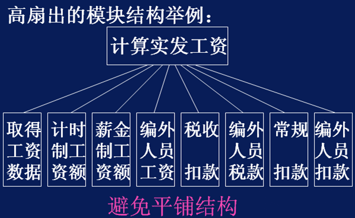

   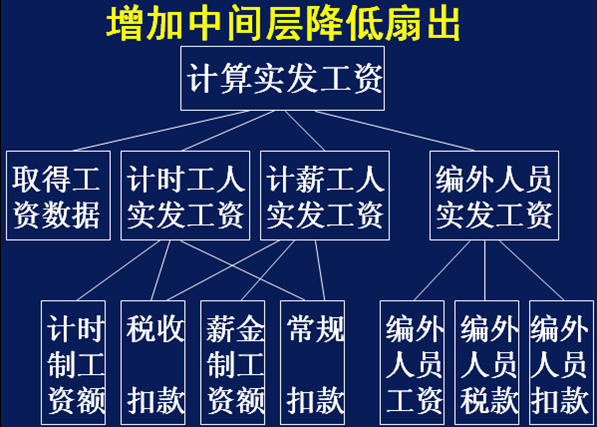

4. 模块作用域应在控制域内

   作用域：受该模块内判定影响的所有模块集合。

   控制域：模块本身及所有直接或间接从属它的模块集合。

   若模块作用域不再控制域内，会增大模块间控制耦合。

   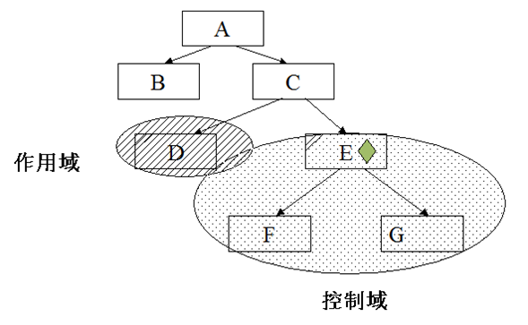

   改善方案一：

   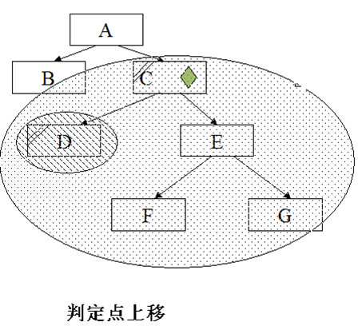

   改善方案二：

   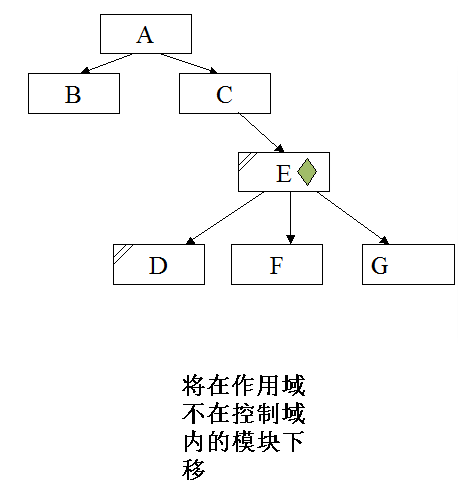

5. 降低模块接口复杂程度

   模块接口复杂是软件发生错误一主要原因。应使信息传递简单且和模块功能一致。

6. 设计单入口、单出口模块

   避免内容耦合

7. 模块功能可预测

   输入数据相同，产生同样输出。模块功能防止过分受限。

   不可预测模块：

   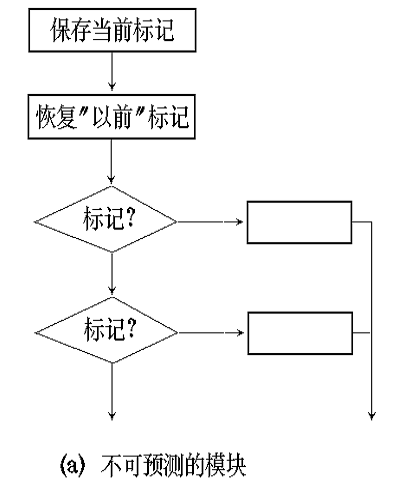

   过分受限模块：

   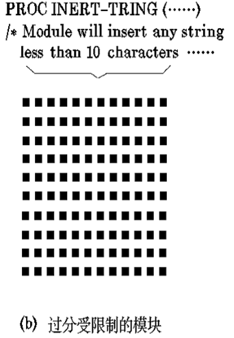

### 七、面向数据流设计方法

​	面向数据流的设计要解决的任务，就是将软件需求分析阶段生成的额逻辑模型数据流图映射（Mapping）表达软件系统结构的软件结构图。

​	结构化设计属于面向数据流的设计方法。

### 7.1 软件结构图

1. 模块一在SC图中用矩形框表示，并用名字来标记它
2. 模块的调用关系和接口

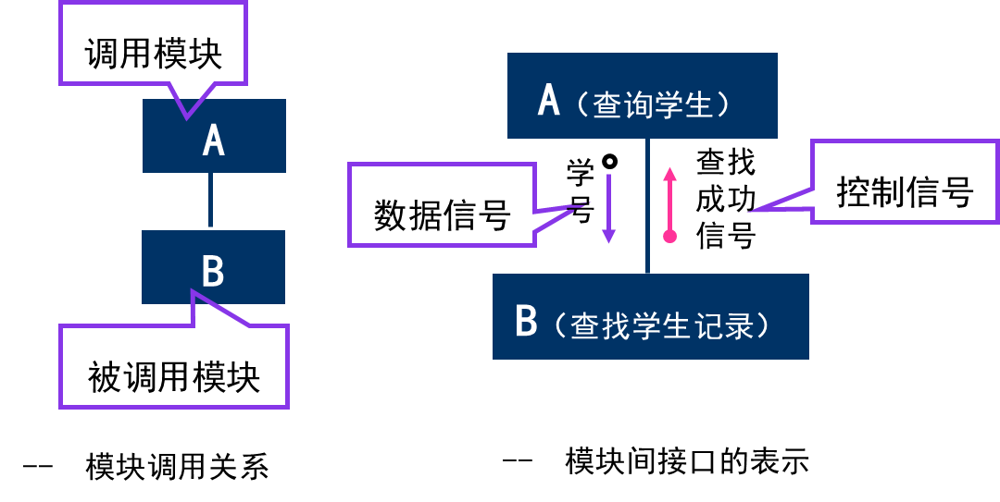

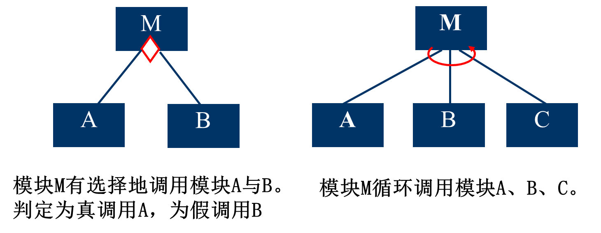

### 7.2 信息流类型

1. 变换流

   信息沿输入通路进入系统，由外部形式变换成内部形式，通过变换中心加工处理后再沿输出通路变换成外部形式离开软件系统。

   

2. 事务流

   信息沿输入通路到处理，由处理根据输入信息类型在若干动作序列中选一个执行。

   处理称**事务中心**，完成任务：

   1. 接收输入信息（又称事务）；
   2. 分析每个事务确定类型；
   3. 根据事务类型选取一活动通路。

   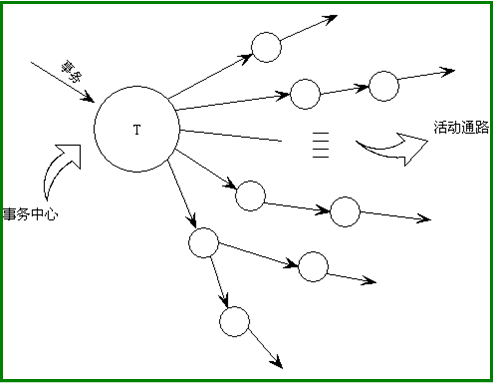

### 7.3 面向数据设计过程

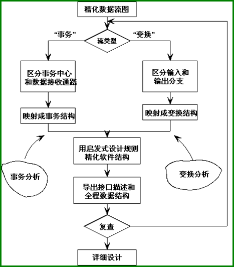

### 7.4 变换分析

将具有变换流特点的数据流图映射成软件结构。

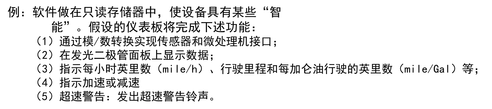

1. 复查基本系统模型

   确保系统输入和输出数据符合实际

2. 复查并精化数据流图

   正确、处理项完成相对独立功能。

   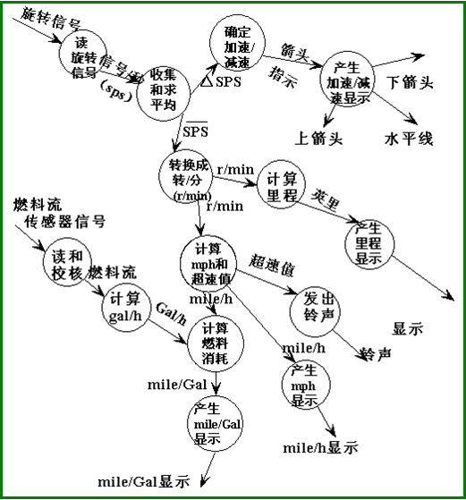

3. 确定数据流图具有变换特性还是事务特性

   没有明确事务中心，为变换型。

4. 找出变换中心

   确定数据流边界。

   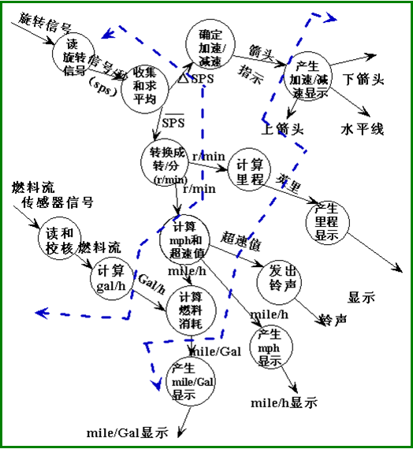

5. 完成一级分解

   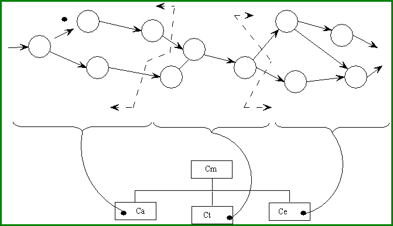

   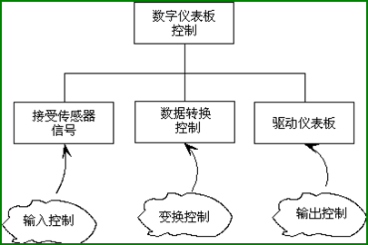

6. 完成第二级分解

   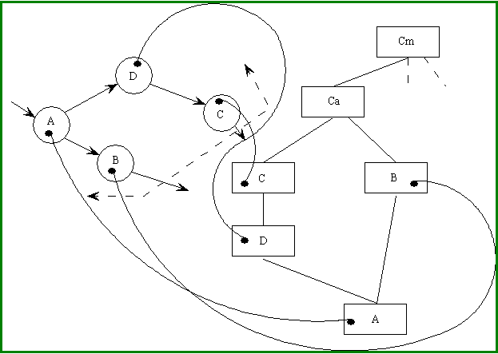

   数字仪表板的第二级分解——输入结构

   

   数字仪表板的第二级分解——变换结构

   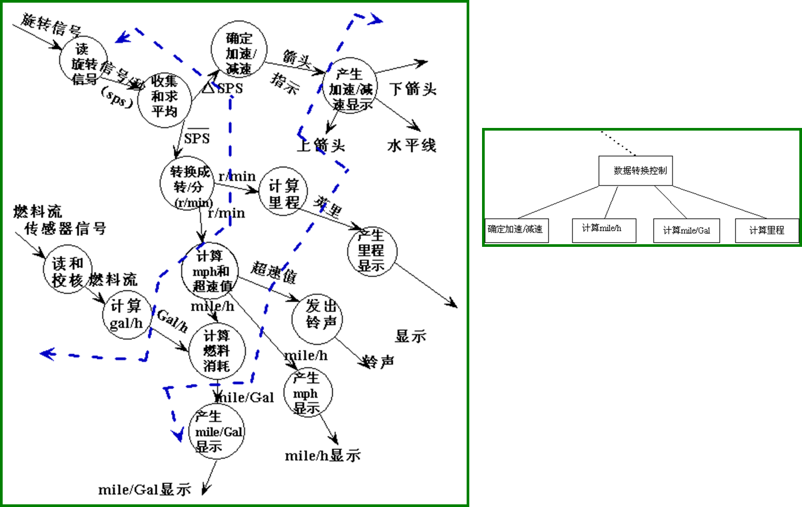

   数字仪表板的第二级分解——输出结构

   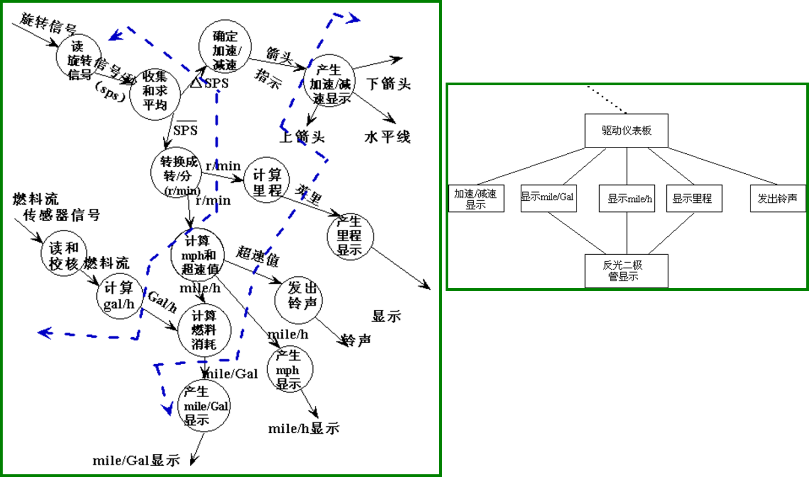

7. 对初步软件结构精华

   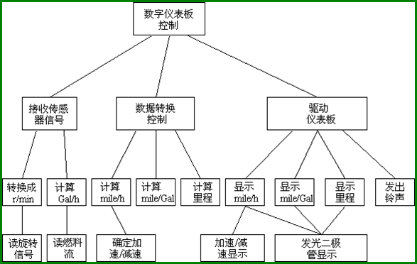

### 7.5 事务分析

​	信息流有明显事务特点（事务中心），采用事务分析方法。

​	软件结构：一接受分支和一发送分支

事务分析映射方法：

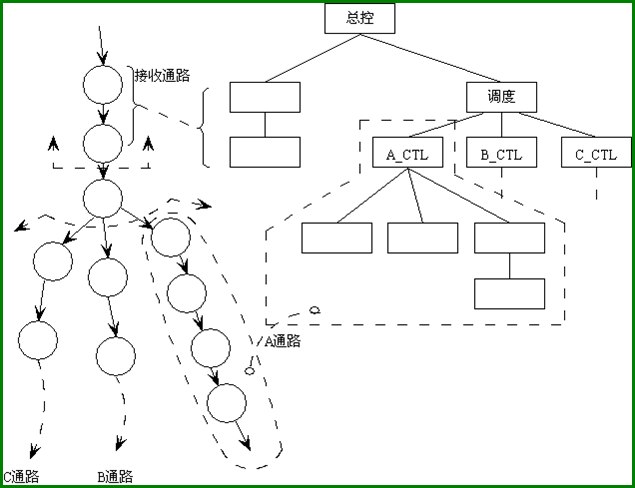

事务分析实例：

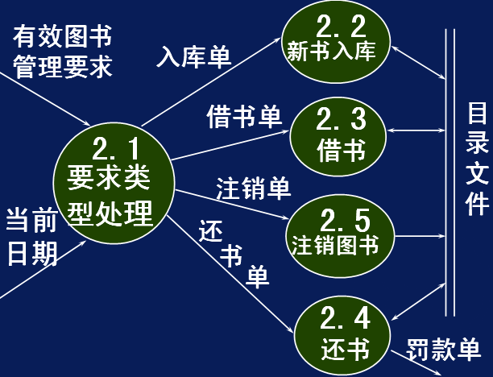

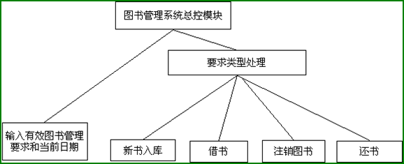

## 八、人机界面设计

### 8.1 人机界面设计问题

1. 系统响应时间

   从用户完成某控制动作，到软件给出预期响应。

   两个重要属性：**长度**和**易变性**。

   **长度：**

   ​	过长，用户感到不安、沮丧。

   ​	过短，迫使用户加快操作节奏，易导致出错。

   **易变性：**

   ​	易变性指响应时间相对平均响应时间偏差，越低越好，否则会让用户误认为系统工作异常。

2. 用户帮助措施

   **手册**和**联机帮助**。

   联机帮助：集成帮助和附加帮助。

   集成帮助设计在软件里面，附加帮助系统建成后加到软件中，前者可用性更强。

   请求帮助：帮助菜单，特殊功能键（F1），HELP命令。

   显示帮助信息：独立窗口、参考某个文档、屏幕固定位置作简短提示。

   组织帮助信息：

   - 平面结构，通过关键字访问
   - 层次结构，查更详细信息
   - 超文本结构

3. 出错信息处理

   - 以用户可用理解术语；
   - 提供清楚、易理解报错信息（出错位置、原因）；
   - 从错误中恢复的建设性意见；
   - 信息用颜色等在视觉上引人注目；
   - 可能造成负面后果。

4. 命令交互

   建议保留命令交互方式：

   - 控制序列：ctrl + c （拷贝）、ctrl + h （帮助）、ctrl + p （打印）
   - 功能键：F1（帮助）
   - 键入命令
   - 命令宏机制：用户定义名字代表一个常用命令序列。

### 8.2 人机界面设计指南

1. 一般交互
   - 保持人机界面菜单选择、命令输入、数据显示风格一致；
   - 提供有意义信息反馈：双向通信；
   - 破坏性动作前要确认：删除、覆盖；
   - 允许取消大多数操作；
   - 减少两次操作之间必须的记忆量；
   - 提高对话、移动和思考的效率；
   - 允许犯错误：保护不受致命错误破坏；
   - 按功能对动作分类，设计屏幕布局；
   - 提供帮助措施；
   - 用简单的动词或动词短语作为命令名。
2. 信息显示
   - 显示与当前工作有关信息；
   - 简单移动方式表示数据：图形、图表；
   - 使用一致标记、标准缩写和可预知颜色；
   - 产生有意义出错信息；
   - 使用模拟的方式显示信息等。
3. 数据输入
   - 减少用户输入动作：鼠标选择、滑动标尺等；
   - 使当前不适用命令不起作用；
   - 交互灵活：保留各种输入方式；
   - 让用户控制交流；
   - 对所有输入都提供帮助；
   - 消除冗余输入：数据单位、整钱后键入.00、提供缺省值等。

## 九、过程设计

### 9.1 过程设计任务

- 确定模块算法

- 确定模块使用数据结构

- 确定模块接口（系统外部接口、用户界面、内部模块间接口细节、输入数据和输出数据）

  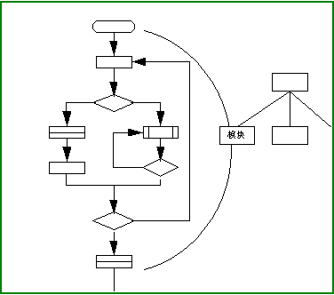

### 9.2 结构化程序设计

结构化程序设计技术是过程设计的关键技术

- 经典定义：程序代码通过顺序、选择、循环三种控制结构连接，单入口单出口。
- 扩展定义：可限制使用GOTO语句、DO_UNTIL和DO_CASE
- 修正定义：LEAVE和BREAK，可从循环中转移出来。

### 9.3 结构化程序设计工具

#### 9.3.1 程序流程图

​	历史最悠久、使用最广泛的过程设计工具。

1. 顺序型：几个连续的加工依次序排列

   

2. 选择型：由某个判定的取值决定选择两个加工中一个。

   

3. 当型循环型：当循环控制条件成立时，重复执行特定的加工。

   

4. 直到型循环型：重复执行特定的加工，直到循环控制条件成立时。

   

5. 多情况选择型：列出多种加工情况根据控制变量的取值，选择执行其一。

   

   程序设计流图标准化图符

   

   

   优点：

   ​	对控制流程描绘直观，便于初学者掌握。

   缺点：

   1. 不是逐步求精的好工具，过早考虑控制流程，非整体结构；
   2. 用箭头代表控制流，程序员随意转移控制；
   3. 不易表示数据结构和调用关系。

#### 9.3.2 N-S图

特点：

1. 功能域（特定控制结构的作用域）明确；
2. 不可能任意转移控制；
3. 容易确定局部和全程数据的作用域；
4. 容易表现嵌套关系，也可表示模块的层次结构。

#### 9.3.3 PAD图

优点：

1. 使用PAD图设计的程序必然是结构化程序；
2. PAD图描绘的程序结构十分清晰；
3. 用PAD图表现程序逻辑，易读、易懂、易记；
4. 容易将PAD图转换成高级语言源程序；
5. 支持自顶向下逐步求精

#### 9.3.4 判定表

能清晰表示复杂的条件组合与应做动作间对应关系。

四部分：

- 左上部列出所有条件；
- 左下部所有可能做的动作；
- 右上部表示各种条件组合的矩阵；
- 右下部是和每种条件组合相对应的动作。

#### 9.3.5 判定树

判定表变种，表示复杂条件组合与应做动作间对应关系。

优点：形式简单，易看出含义，易于掌握和使用。

缺点：简洁性不如判定表，相同数据元素重复写多遍，越接近叶端重复次数越多。

#### 9.3.6 过程设计语言

​	伪码，用正文形式表示数据和处理过程设计工具

​	PDL具有严格关键字外部语法，定义控制结构和数据结构；

​	PDL表示实际操作和条件的内部语法灵活自由。适应各种工程项目需要。

### 9.4 程序复杂度

​	McCabe方法

1. 根据过程设计结果画出相应流图

   流图描述程序控制流，基本图形符号如下图所示。

   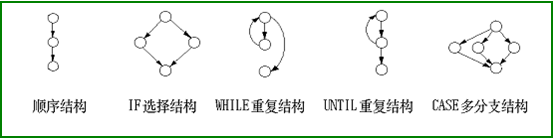

   流程图映射成流图

   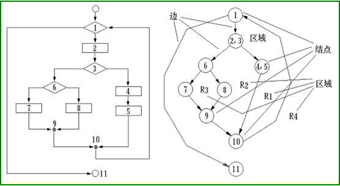

   符合条件下流图映射

   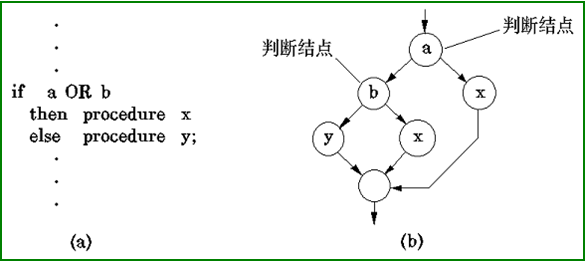

2. 计算流图的环形复杂度

   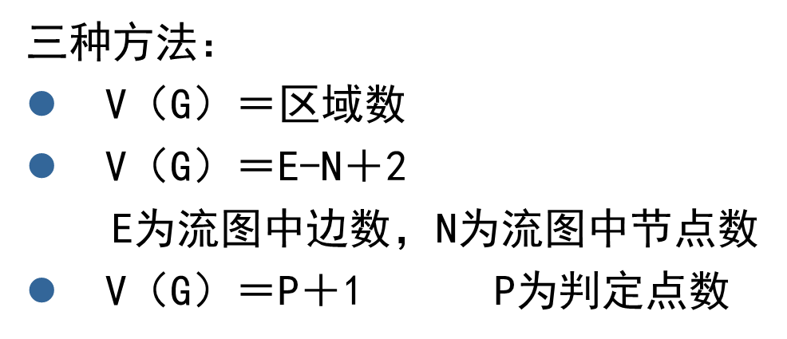

   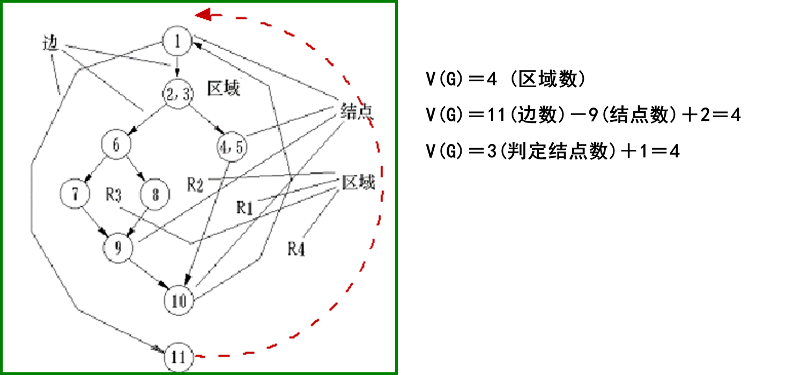

## 十、面向数据结构设计方法

​	数据结构既影响程序的结构也影响程序的处理过程，可从数据结构导出程序的处理过程，适合详细设计。

​	面向数据结构设计方法两种：**Jacksom**和Warnier方法。

## 10.1 Jackson图

描述数据结构：顺序、选择、重复。

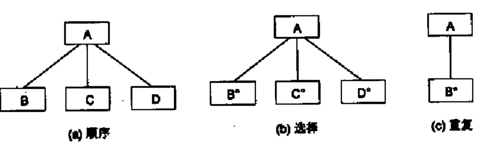

改进：直线，选择和循环结束条件。

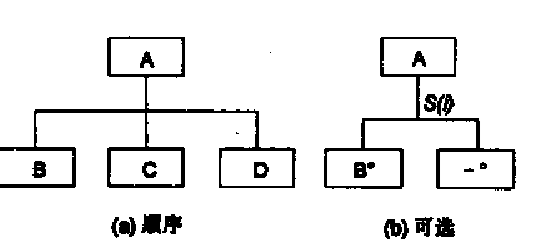

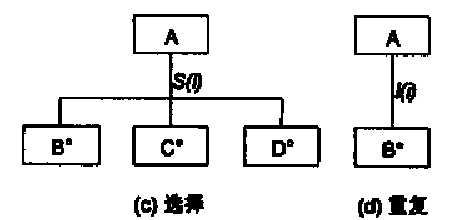

## 10.2 Jackson方法步骤

1. 确定输入数据和输出数据逻辑结构，用Jackson图表达；
2. 确定输入结构和输出结构中有对应关系（因果）的单元；
3. 描绘数据结构的Jackson图导出描绘程序结构Jackson图；
4. 列出所有操作和条件，分配到Jackson图中；
5. 用伪码表示。

