# 第二章 结构化分析概述

## 一、需求分析重要性

​	对软件需求深入理解是开发成功的前提和关键。

​	开发软件系统最困难的部分就是准确说明开发什么，最困难的概念性工作是编写出详细需求，包括所有面向用户、面向机器和其他软件系统的接口

​	此工作一旦做错，将会给系统带来极大损害，并且以后对它修改也极为困难。

## 二、结构化分析核心思想

- 分解化简问题
- 物理与逻辑表示分开
- 进行数据与逻辑抽象

## 三、结构化分析具体步骤

1. 发现需求

   - 与用户交谈，向用户提问题；
   - 参观用户的工作流程，观察用户的操作；
   - 向用户群体发调查问卷；
   - 与同行、专家交谈，听取他们的意见；
   - 分析已经存在的同类软件产品，提取需求；
   - 从行业标准、规则中提取需求；
   - 从Internet上搜查相关资料等。

2. 求精

   - 对初步需求反复求精多次细化。

3. 建模

   - 建立模型，用图形符号和组织规则书面描述事物。

     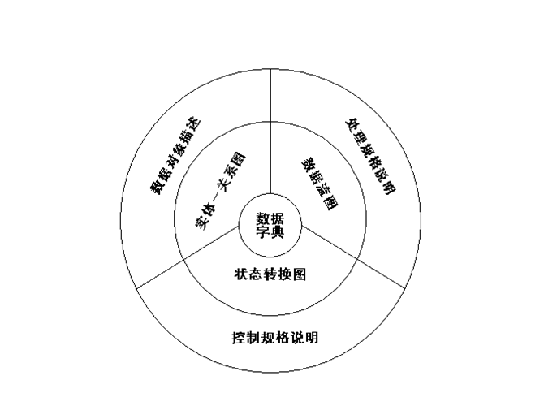

     **模型核心：数据字典**

     ​	描述软件使用和产生的**所有数据对象**

     **数据模型：实体关系图（E-R图）表达**

     ​	描述**数据对象间**关系

     ​	图中数据对象属性用“**数据对象描述**”表达

     **功能模型：DFD表达**

     ​	描绘数据在软件中**移动，变换**及相应功能

     ​	图中功能用“**处理规格说明**”表达

     **行为模型：状态转换图**

     ​	描绘系统状态和在**不同状态**间转换方式

     ​	图中软件控制附加信息用“**控制规格说明**”表达

4. 规格说明

   - 书写软件需求规格说明，作为分析阶段最终成果

5. 复审

****

### 3.1 数据模型

- 数据模型组成

  - 数据对象

    软件必须理解的复合信息表示，复合信息是具有一系列不同性质或属性的事物。

    事务（报表）、地点（仓库）、角色（教师、学生）、单位（会计科）、行为（打电话）等

  - 数据对象间关系

    对象彼此间相互连接方式，也称联系。

    分三类： 1:1  1:N  M:N

  - 属性

    定义数据对象性质。

    数据对象学生的属性可为学号、姓名、班级等。

- 实体关系图

  ​	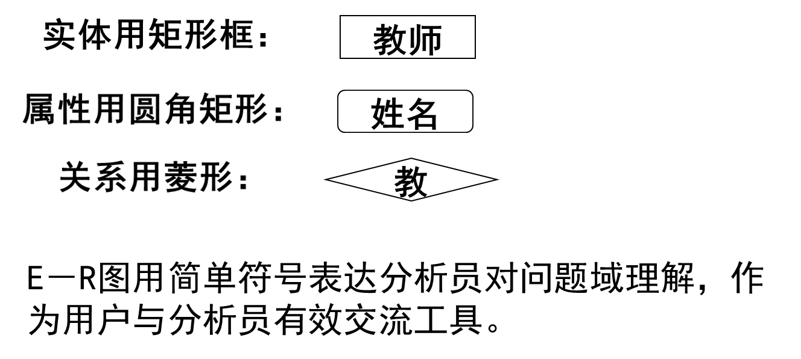

  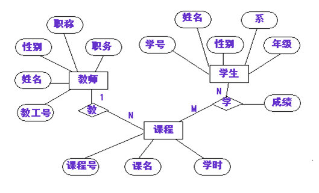

- 实例

  请为某仓库的管理设计一个ER模型，该仓库主要**管理零件的订购**和**供应**等事项。**仓库向工程项目供应零件**，并且根据需要**向供应商订购零件**。
  “零件”的主要属性是：零件编号，零件名称，颜色，重量。

   “工程项目”的属性主要是：项目编号，项目名称，开工日期。

  “供应商”的属性主要有：供应商编号，供应商名称，地址。

  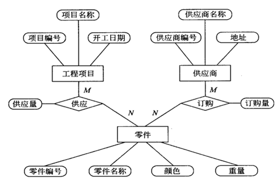

****

### 3.2 数据流图

​	数据流图（DFD）描绘系统逻辑模型，图中没具体的物理元素，只描绘信息在系统中流动处理情况。

​	是非常好通信工具和软件设计出发点。

#### 3.2.1 数据流图符号

- 四种基本符号：

  - 正方形（或立方体）：表示数据的源点或终点

    

  - 圆角矩形（或圆形）：代表变换数据的处理

    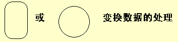

  - 开口矩形（两条平行横线）：代表数据存储

    

  - 箭头：表示**数据流**、即**特定数据的流动方向**

    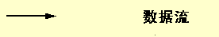

  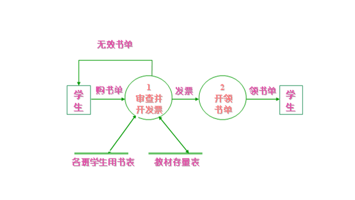

- 数据流图附加符号

  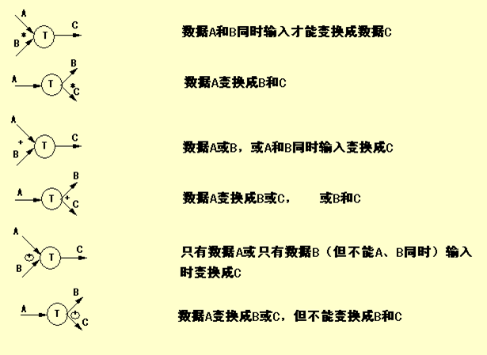

#### 3.2.2 数据流图范例

- 范例

  工厂采购部采购员每天需一张**定货报表**，按零件编号排序列出所需定货零件。

  ​	对定货零件列下述数据：零件编号、名称、定货数量、目前价格，主次要供应者等。

  ​	零件入库或出库称**事务**，通过仓库终端把事务报告定货系统。零件库存量少于库存临界值需订货。

  

- 解法：

  1. 从问题描述提取数据流图四种成分

     - 先考虑源点和终点

       源点：仓库管理员

       终点：采购员

     - 再考虑处理

       处理：处理事务、产生报表等

     - 最后考虑数据流和数据存存储

       数据流：事务、订货信息、订货报表

       数据存储：订货信息、库存信息

  2. 着手画数据流图的基本系统模型

     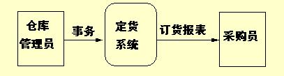

  3. 把基本系统模型细化，描绘系统主要功能

     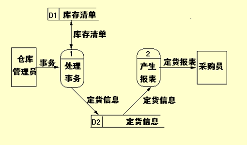

  4. 主要功能进一步细化

     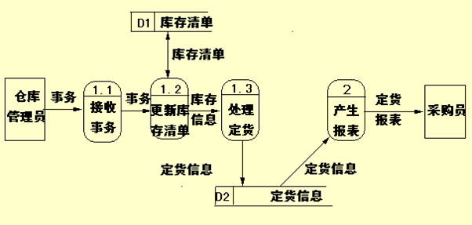

  5. 结束、进一步分解涉及如何具体实现功能时，不应再分解

#### 3.2.3 分层数据流图

​	为表达数据加工情况，需采用层次结构数据流图。

​	顶层数据流图包含一个加工项；

​	底层数据流图指加工项不再分解的数据流图；

​	中间层流图只在顶层和底层之间，对其上层父图的细化。

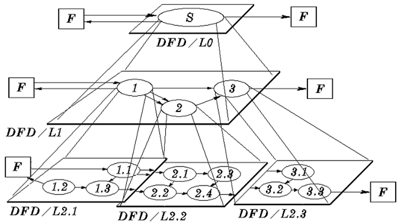

- 分层法绘制流程图的几个问题

  1. 编号的设置

     子图的编号是父图相应的处理逻辑的编号。

     子图中处理逻辑编号由子图号、小数点与局部号组成。

     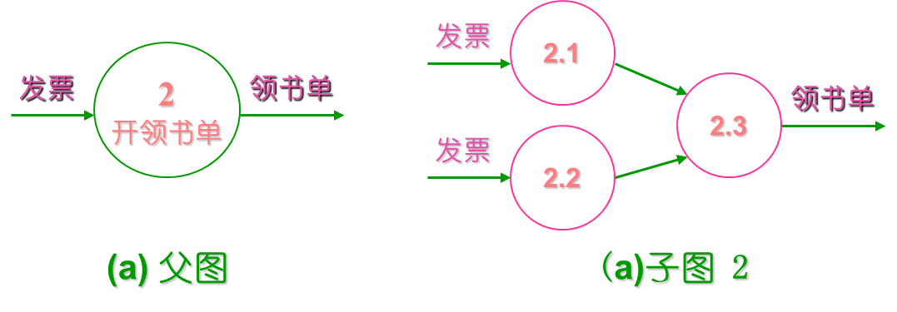

#### 3.2.4 数据流图命名规则

#### 3.2.5 数据流图用途

#### 3.2.6 数据流图习题