# 第五章 UML

## 一、面向对象方法学

传统软件工程方法学适用于中小型软件产品开发；

面向对象软件工程方法学适用于大型软件产品开发。

面向对象方法学方程式：

​	OO = 对象 + 类 + 继承 + 传递消息实现通信

### 5.1 面向对象方法学概念

1. 对象：具有相同状态的一组操作的集合，对状态和操作的封装。

   形象表示：

   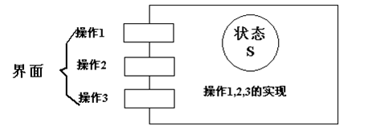

2. 类

   对具有相同状态和相同操作的一组相似对象的定义。

   类是一个抽象数据类型。

3. 实例

   实例是由某个特定类所描述的一个具体对象。

   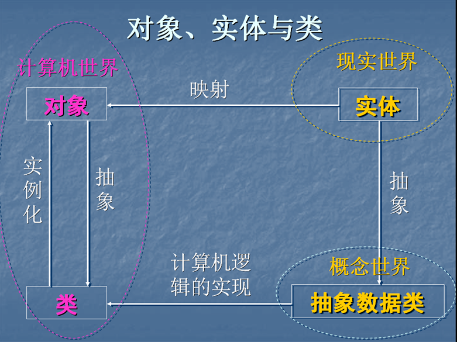

4. 消息

   要求某对象执行某个操作的规格说明。

   三部分：

   - 接受消息的对象
   - 消息名
   - 0或多个变元

5. 方法和属性

   - 方法：对象执行的操作，即类中定义的服务。
   - 属性：类中所定义数据，对客观世界实体具体性质的抽象。

6. 继承

   子类自动共享基类中定义的属性和方法的机制。

   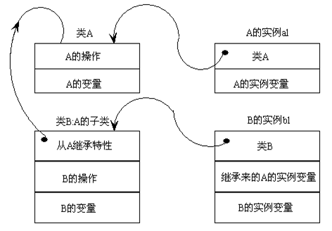

7. 多态性

   在类等级不同层次可共享一个方法名，不同层次每个类按各自需要实现这个方法。

   A是基类，B和C是A的派生类，多态函数Test参数是A的指针，Test函数可以引用A、B、C的对象

   - 优点：
     - 提高程序可复用性（接口设计的复用，不是代码实现的复用）
     - 派生类的功能可被基类指针引用，提高程序可扩充性和可维护性。

8. 重载

   1. 函数重载

      在同一作用域内，参数特征不同的函数可使用相同的名字。

      - 优点

        调用者不需记住功能雷同函数名，方便用户；

        程序易于阅读和理解。

   2. 运算符重载

      同一运算符可施加于不同类型操作数上面。

### 5.2 与传统方法学比较

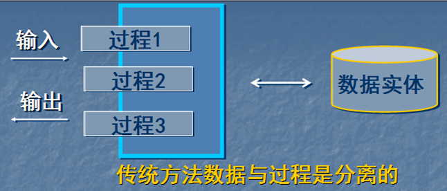

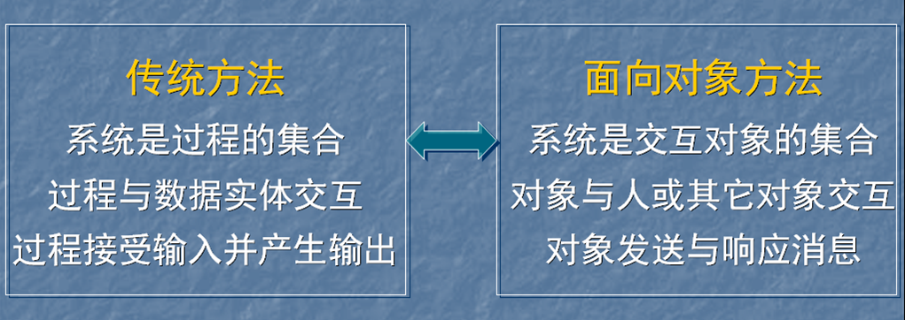

### 5.3 面向对象方法学优点

1. 与人类习惯思维方法一致

   对象是对现实世界正确抽象，问题空间和解空间结构一致。

2. 稳定性好

   软件系统结构根据问题领域模型建立，功能需求变化不会引起软件结构整体变化，作局部性修改。

   如从已有类派生新子类实现功能扩充或修改。

3. 可重用性好

   传统软件重用技术：标准函数库。

   面向对象重用技术：类，派生类和创建类的实例

4. 易开发大型软件产品

   封装性好，易于分解，易于合作开发。

5. 可维护性好

   稳定性好、容易修改、容易理解、易于测试和调试。

## 二、UML简介

UML全称为Unified Modeling Language，目前最流行的面向对象建模语言。

### 2.1 建模必要性

“建模是捕获系统本质的过程”

- 捕获商业流程
- 促进沟通
- 管理复杂性
- 定义软件构架
- 促进软件复用

### 2.2 UML发展

UML全称为Unified Modeling Language

UML是图示化、说明、构造一个软件系统并生成其文档的标准语言。

UML独立于开发过程，可与大多数面向对象开发过程配合使用

UML独立于程序设计语言，可用C++、Java等任何一种面向对象程序语言实现。

### 2.3 UML构成

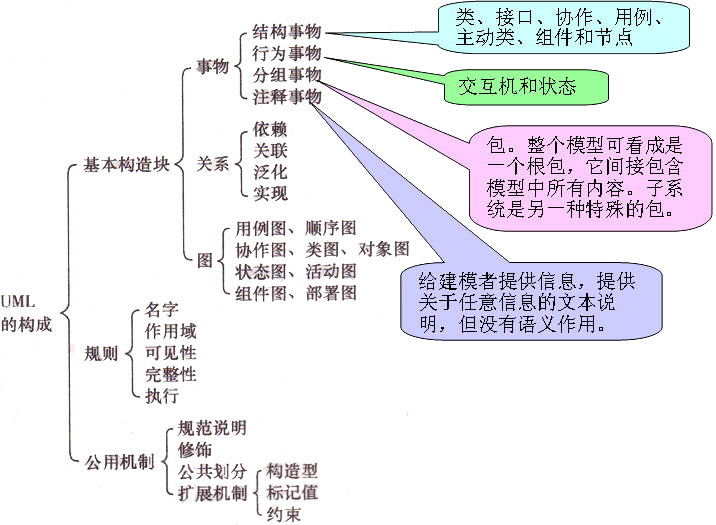

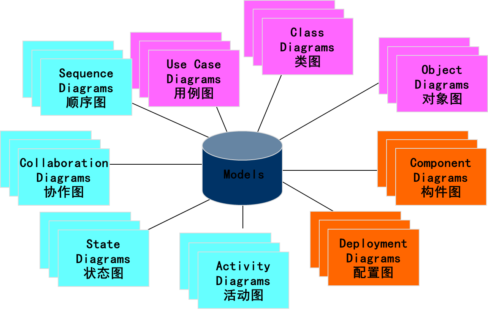

### 2.4 UML视图

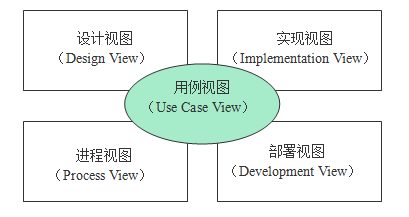

不同的视图突出特定的参与群体所关心的系统的不同方面，通过合并所有五个视图中得到的信息就可以形成系统的完整描述。

1. 用例视图

   定义了系统的外部行为，是最终用户、分析人员和测试人员所关心。该视图定义了系统的需求，因此约束了描述系统设计和构造的某些方面的所有其他视图。

2. 设计视图

   描述的是支持用例视图中规定的功能需求的逻辑结构。它由程序组件的定义，主要是类、类所包含的数据、类的行为以及类之间交互的说明组成。

3. 实现视图

   描述构造系统的物理组件，这些组件包括如可执行文件、代码库和数据库等内容。这个视图中包含的信息与配置管理和系统集成这类活动有关。

4. 进程视图

   进程视图包括形成并发和同步机制的进程和线程。

5. 部署视图

   部署视图描述物理组件如何在系统运行的实际环境中分布。

## 三、UML静态建模——用例图

用例图描述外部执行者（actor）与系统的交互，表达系统功能，即系统提供服务。

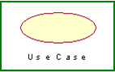

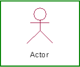

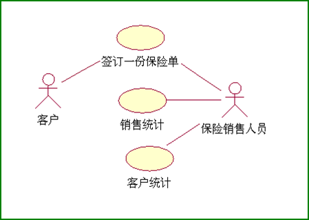

主要元素：**用例**和**执行者**。

用例：执行者与计算机一次典型交互，代表系统某一完整功能。

执行者：描述与系统交互的人或物，代表外部实体。

### 3.1 UML用例图案例

案例：建立一航空公司的机票预定系统，让客户通过电
话或网络买票、改变订票、取消订票、预定旅馆、租
车等等。

建立用例模型：

1. 发现执行者

   - 谁使用该系统；

   - 谁改变系统的数据；

   - 谁从系统获取信息；

   - 谁需要系统的支持以完成日常工作任务；

   - 谁负责维护、管理并保持系统正常运行；

   - 系统需要应付那些硬件设备；

   - 系统需要和那些外部系统交互；

   - 谁对系统运行产生的结果感兴趣。

     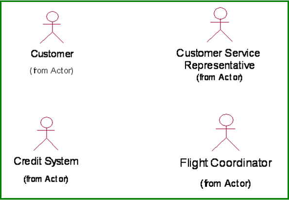

2. 获取用例

   向执行者提出问题获取用例：

   - 执行者需获取何种功能，需要作什么；
   - 执行者需读取、产生、删除、修改或存储系统中某种信息；
   - 系统发生事件和执行者间是否需要通信。

   用户观点非系统观点

   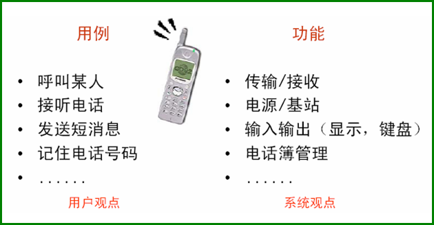

   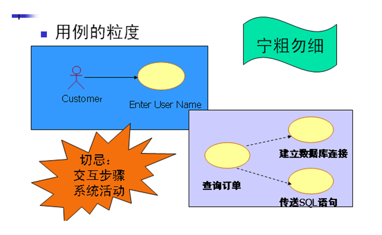

   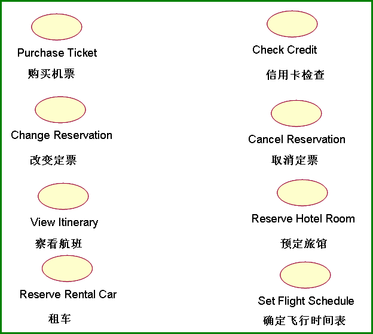

3. 执行者间关联

   泛化关系

   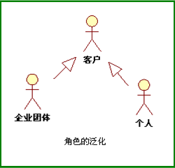

4. 用例间关系

   **泛化关系：**

   一般关系与特殊关系

   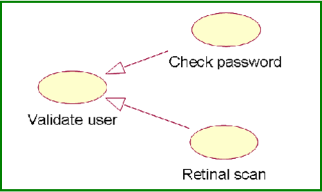

   有父用例的行为，可出现在父用例出现的任何地方。添加自己行为。

   **扩展关系：**

   允许一个用例扩展另一用例提供的功能，与泛化关联类似，有更多规则限制：

   基本UseCase必须声明若干“扩展点”，扩展UseCase只能在扩展点上增加新行为。

   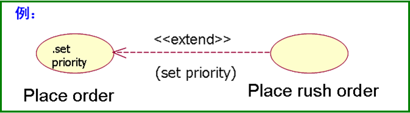

   **包含关系：**

   一个基本UseCase行为包含另一个UseCase行为。

   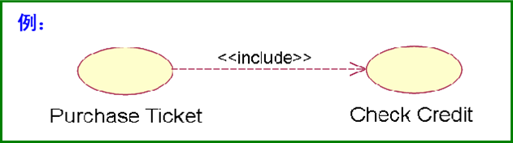

   Check Credit检查输入的信用卡号是否有效，有足够资金。处理Purchase Ticket用例，总运行Check Credit用例。

   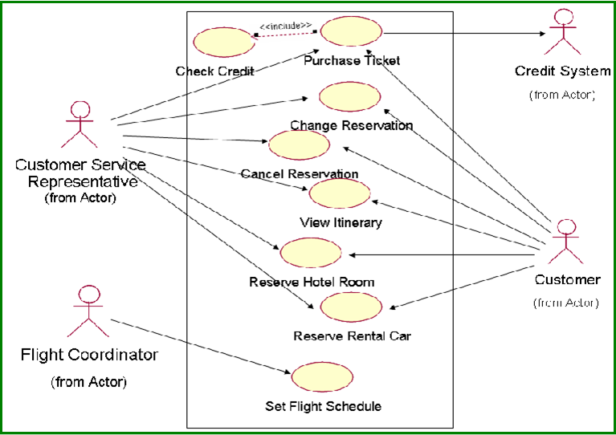

## 四、状态转换图

### 4.1 UML状态转换图图形元素

表示一个对象生存史，显示触发状态转移的事件和因状态改变导致的动作

1. 状态

   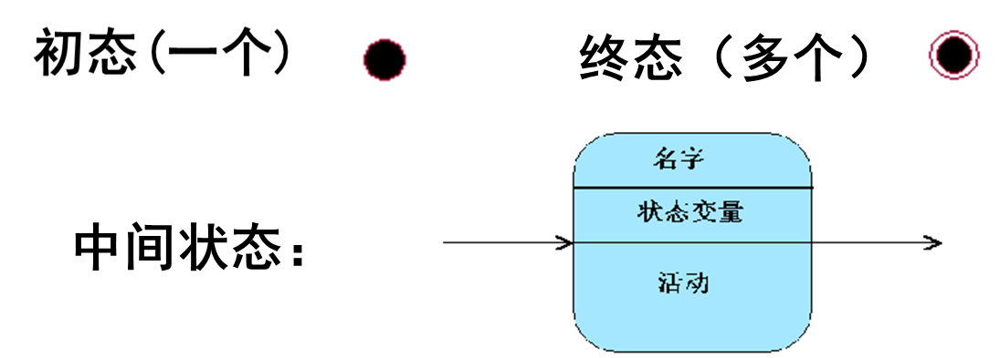

   活动：活动名/动作表达式

   entry入口活动、exit出口活动、do内部执行活动

   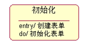

   组合状态：包含嵌套的子状态

   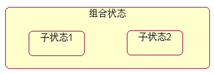

2. 状态转换

   时间说明[ 守卫条件 ] / 动作表达式^发送子句

   事件说明：事件名（参数表）

   守卫条件：事件发生且守卫条件为真状态转换

   动作表达式：状态转换开始，执行的表达式

   发送子句：动作特例，在状态转换期间发送消息

   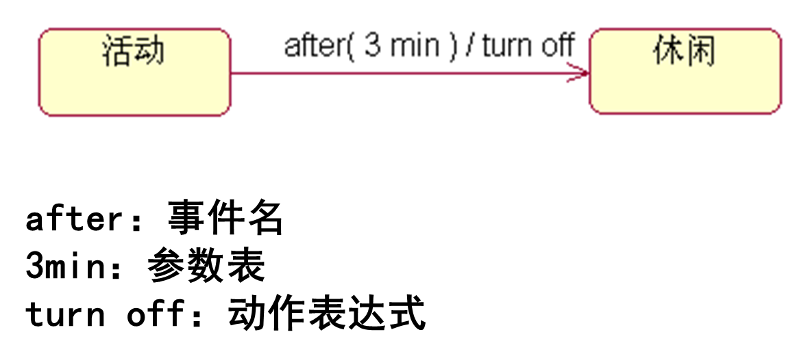

3. 判定

   工作流按保安条件取值发生分支。

   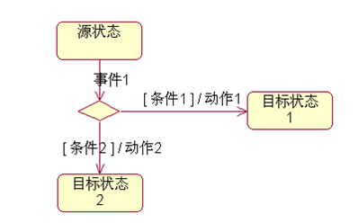

4. 历史状态

   转移到组合状态的历史状态，对象恢复上次离开组合状态的最后一个子状态。

   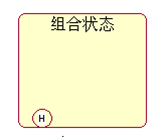

   

### 4.2 UML状态转换图示例

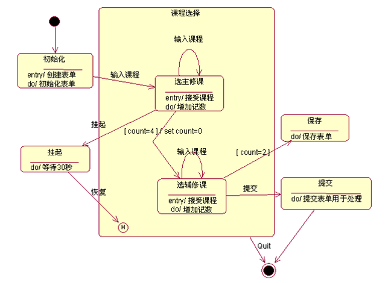

## 五、顺序图、协作图、活动图

### 5.1 消息

对象间交互通过消息。

1. 简单消息：没有描述通信的细节

   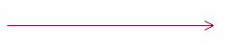

2. 同步消息：调用者发出消息后等待消息返回后再继续执行。

   

3. 异步消息：调用者发出消息后不等待消息返回就继续执行

   

4. 返回消息：代表从过程调用的返回。

   过程控制流：可省，隐含每个调用有配对返回。

   非过程控制流（异步）：不可省

### 5.2 顺序图（sequence diagram）

顺序图描述对象间交互关系。

对象用矩形表示，框内标对象名；

矩形框下的竖线代表对象的生命线；

对象生命线上的细长矩形框表示对象被激活；

对象间通信用对象间水平消息线表示，箭头形状表明消息类型（同步、异步或简单）

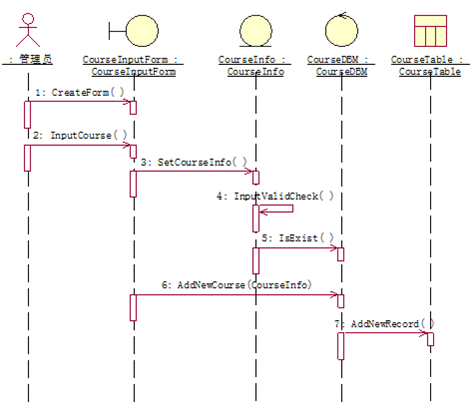

### 5.3 协作图（Collaboration diagram）

协作图描述相互协作对象间交互关系和链接关系。

顺序图着重表现交互时间顺序；

协作图着重表现交互对象的静态链接消息；

协作图显示对象间处理过程的分布。

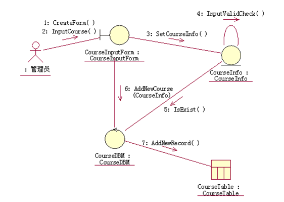

### 5.4 活动图（Activity diagram）

活动图描述为完成某一个用例需要做的活动以及这些活动的执行顺序。

活动图由状态图变化而来，各自用于不同目的。状态图着重描述对象的状态变化以及触发状态变化的事件活动图着重描述各种活动的执行顺序。

业务活动流的分劈和接合用粗短线（同步杆）表示。

一入多出为分劈；

多入单出为接合。

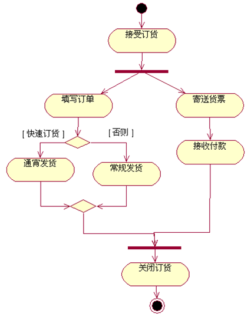

泳道：对象对活动的责任。泳道把活动分成若干组，把组指定给对象，对象履行该组活动。

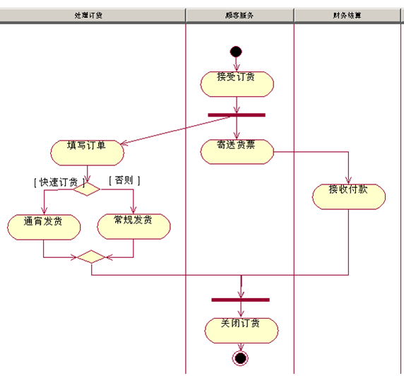

## 六、 UML物理框架机制

系统架构：逻辑架构；物理架构。

逻辑架构：描述系统功能。用例图、类图、对象图、状态图、活动图、协作图、顺序图。

物理架构：关系的是实现。类和对象物理上分布在那个程序或进程中；程序进程在哪台计算机上运行；系统有哪些硬件设备，如何连接。**构建图**和**配置图**。

### 6.1 构件图

构件图（Component Diagrams）展现了一组构件的类型、内部结构和它们之间的依赖关系。

构件代表系统一物理实现块，一般作为一独立文件存在。

构件种类：**部署构件** **工作产品构件** **执行构件**

- 部署构件

  是构成一可执行系统必要构件，如操作系统，Java虚拟机。

- 工作产品构件

  开发过程产物，包括源代码文件及数据文件。构件不直接参与可执行系统，用来产生可执行系统的中间工作产品。

- 执行构件

  构件一可执行系统必要构件，动态链接库、exe文件、CORBA构件、.net构件等。

  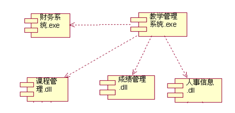

### 6.2 配置图

配置图（Deployment diagram）描述了系统硬件和软件物理配置情况和系统体系结构，显示系统运行时刻的结构。

配置图包含结点和连接两个元素，配置图中的结点代表实际的物理设备以及在该设备上运行的构件和对象，结点的图符是一个立方体。

配置图各结点之间进行交互的通信路径称为连接，用结点间的连线表示。

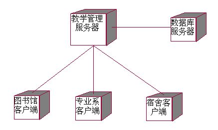

## 七、UML扩展机制

利用扩展机制，用户可定义使用自己的模型元素。

### 7.1 标签值

标签值是存储元素相关信息字符串，可附加在任何独立元素（图形元素、视图元素）。

标签是建模人员需要记录某些特性的名称；

值是给定特性的值。

标签值对项目管理特别有用，如元素创建日期、开发状态、完成日期和测试状态。

标签值用{}括起。

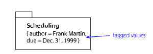

### 7.2 约束

约束是用文字表达式表达的语义限制，对声明全局的或影响大量元素的条件特别适用。

约束表示为括号中的表达式字符串，附加在类、对象、关系上和注释上等。

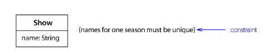

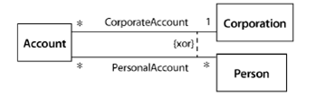

### 7.3 版类

版类（版型）在模型本身中定义的一种模型元素，UML元素具有通用语义，利用版类进行专有化和扩展，在已有元素上增加新语义。

版类用放置在基本模型元素符号中或附近的被《》括起

的文字串显示，还可为特殊版型创建图标，替换基本元素符号。

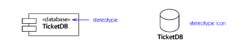

## 八、UML实例

拟开发一软件，完成学校管理中的教务部分功能，包括班级管理、课程管理、账户管理等。

### 8.1 用例图设计

主用例图：

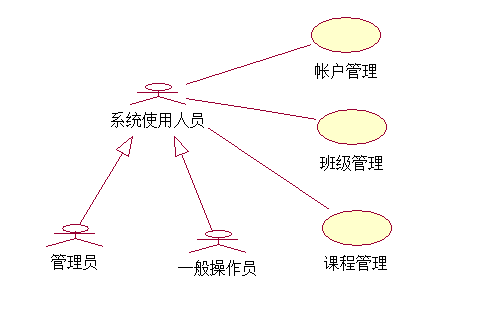

班级管理子用例图

课程管理子用例图：

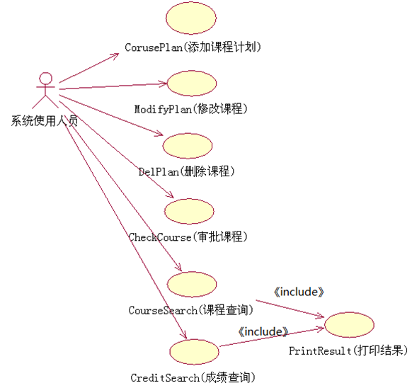

账户管理子用例图：

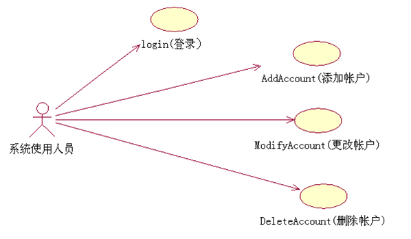

### 8.2 创建顺序图

账户管理顺序图：

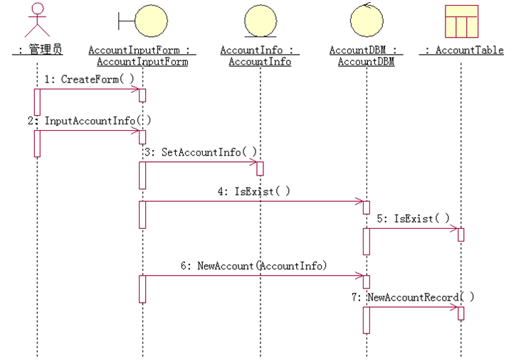

账户管理协作图：

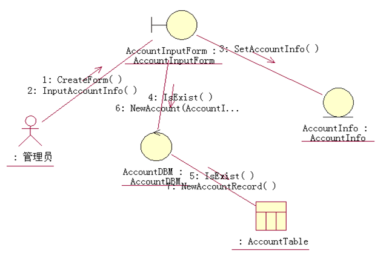

删除账户顺序图：

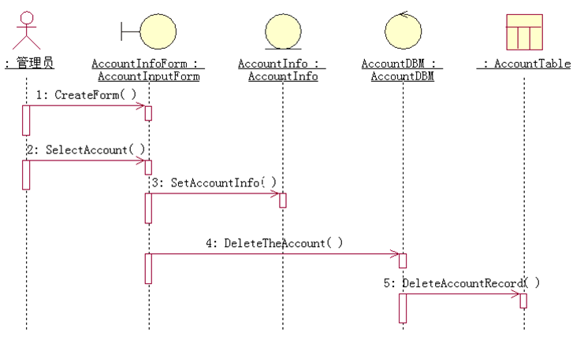

修改账户顺序图：

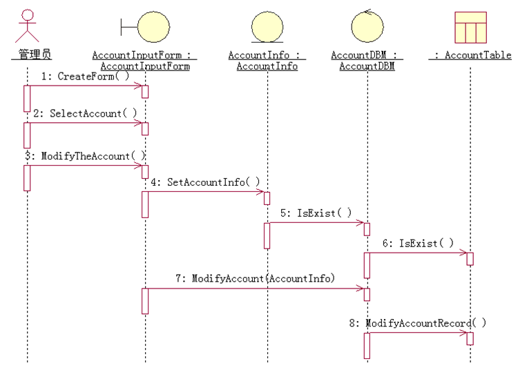

### 8.3 创建类图

账户管理类图：

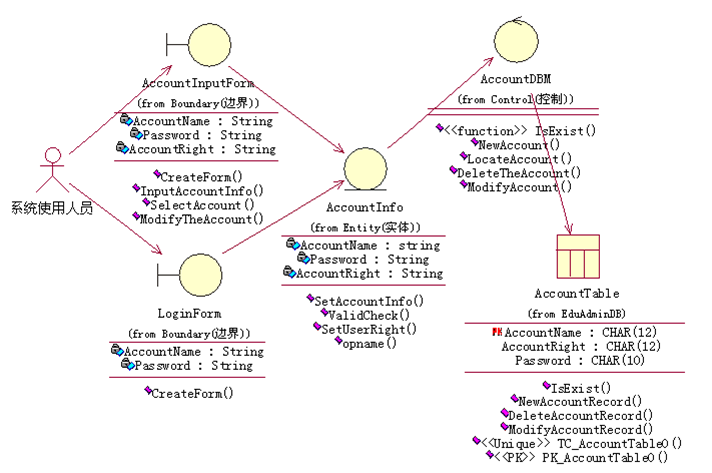

课程管理类图：

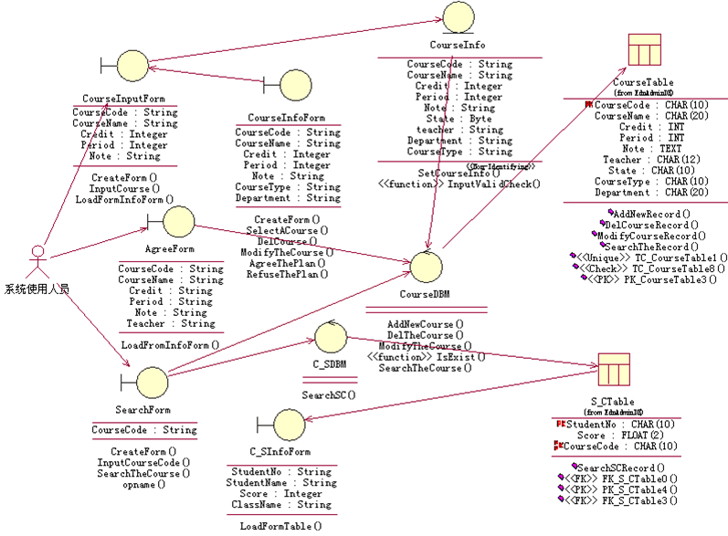

班级管理类图：

### 8.4 生成核心代码

详细功能代码可在实现软件时再补充，也可实现由代码到类图的逆向工程。

### 8.5 建立数据模型

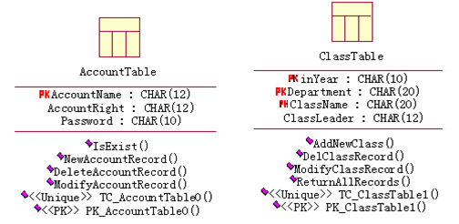

数据模型转换为物理数据库：

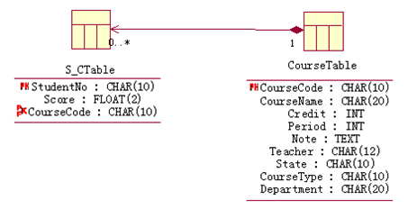