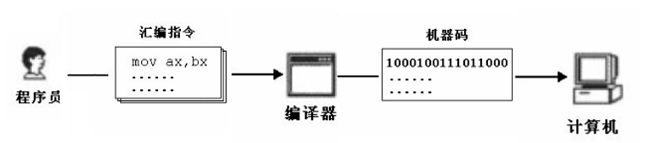

# 第四章 结构化系统实现

## 一、编码

编码的目的

- 把模块的过程性描述翻译为用选定的程序设计语言书写的源程序

依据

- 编码的主要依据是概要设计和详细设计说明文档

任务

- 理解概要设计和详细设计说明书
- 遵循编码原则和风格进行翻译，形成源代码

程序设计语言分类

1. 机器语言

   1011011000000000：加法

   1011010100000000：减法

   - 优点：计算机直接识别
   - 缺点：效率低，重用性差

2. 汇编语言

   机器指令助记符

   - 机器指令：10000100111011000

   - 汇编指令：MOV AX,BX

     

   - 优点

     - 比机器语言易读写、易调试和修改
     - 执行速度块、占内存少
     - 针对硬件编制

   - 缺点

     - 不能编写复杂程序
     - 依赖于机型、不通用、不可移植

3. 高级语言

   与自然语言相近，面向用户的语言

   - 优点
     - 编码效率高
     - 通用性强，兼容性好，便于移植
   - 缺点
     - 运行效率低
     - 对硬件操作不如汇编

4. 语言选择标准

   - 系统用户要求

     如果开发系统由用户维护，通常要求用熟悉的语言书写

   - 可以使用的编译程序

     运行目标系统环境可提供编译程序限制可选用语言的范围

   - 可以得到的软件工具

     有支持程序开发的软件工具可以利

   - 工程规模

     规模庞大，现有语言不适用，设计实现供该工程项目使用程序设计语言

   - 程序员知识

     如果和其他标准不矛盾，应选择程序员熟悉的语言

   - 软件可移植性要求

     若目标系统在不同计算机上运行，选择可移植性好的语言

   - 软件的应用领域

     选择语言时应充分考虑目标系统的应用范围

5. 编码风格

   逻辑简明清晰、易读易懂是重要标准

   可遵循一下五方面规则

   1. 程序内部的文档
   2. 数据说明
   3. 语句构造（简单）
   4. 输入输出
   5. 效率（和存储容量）

****

## 二、软件测试基础

软件测试的目标：

1. 测试是为了**发现程序中的错误**而执行程序的过程；
2. 好的测试方案是极有可能发现迄今尚未**发现的尽可能多的错误**的测试；
3. 成功的测试是发现了迄今**尚未发现的错误**的测试。

黑盒测试和白盒测试

- 黑盒测试：如果知道产品应具有**功能**，可通过测试来检验是否每个功能都能正常使用。
- 白盒测试：如果知道产品**内部工作过程**可通过测试来检验产品内部动作是否按照规格说明书的规定正常进行。

测试准则

1. 所有测试应能追溯到用户需求，测试的目的是发现错误，其中最严重的是不能满足用户需求的错误。

2. 应尽早地和不断地进行软件测试。

   不应把软件测试看作是软件开发一独立阶段，应把它贯穿到软件开发各阶段中。

3. 充分注意测试中群集现象

   测试后程序中残存错误数与程序中已发现错误数目成正比，80%错误与20%模块有关。

4. 测试应从小规模开始，逐步进行大规模测试。

   耽搁模块，逐步集成。

5. 不能做到穷举测试

   穷举测试：程序所有可能执行路径都检查遍。

6. 第三方测试原则

   从心理学角度考虑。

